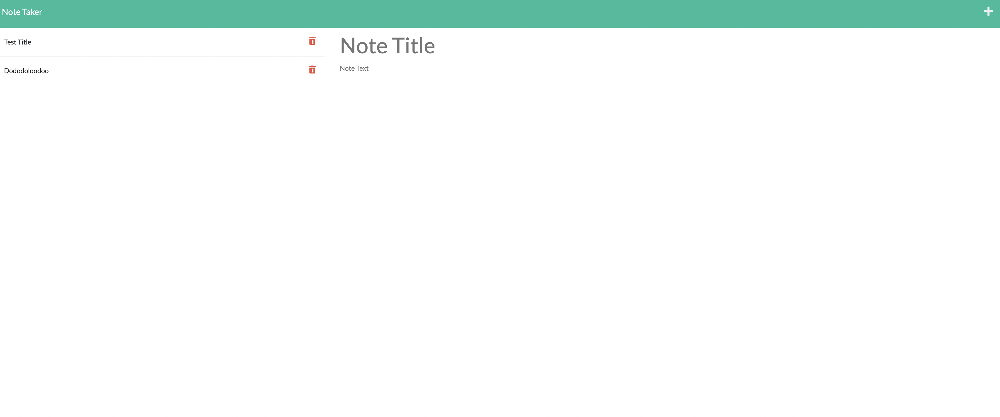

# Note-Taker


## Description 
An application called Note Taker that can be used to write and save notes. This application uses an Express.js back end and will save and retrieve note data from a JSON file.


## Table of Contents 
1. [Deployed Link](#deployed-link)
2. [Repo](#Repo)
3. [Installation](#installation)
4. [Usage](#usage)
5. [Contributing](#contributing)
6. [Screen Shots](#Screen-Shots)

## Deployed Link
[Deployed on Heroku](https://pacific-ravine-86012.herokuapp.com/)

## Repo
[Github Repository](https://github.com/linklg1/Note-Taker.git)

## Installation
``` bash
npm install

```


## Usage

Use the deployed site link above to navigate to app. Insert notes and click save button on the left to save notes. Use the delete buttons to remove notes.


## Contributing

Pull requests are welcome. 


## Screen shots




